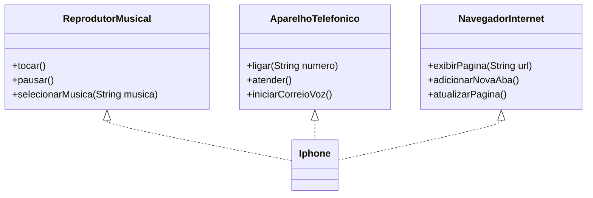

# Diagrama de Classes do Projeto iPhone

Modelo UML que representa a estrutura do projeto.

```mermaid
classDiagram
    class ReprodutorMusical {
        +tocar()
        +pausar()
        +selecionarMusica(String musica)
    }

    class AparelhoTelefonico {
        +ligar(String numero)
        +atender()
        +iniciarCorreioVoz()
    }

    class NavegadorInternet {
        +exibirPagina(String url)
        +adicionarNovaAba()
        +atualizarPagina()
    }

    class Iphone {
        
    }

    ReprodutorMusical <|.. Iphone
    AparelhoTelefonico <|.. Iphone
    NavegadorInternet <|.. Iphone
```
